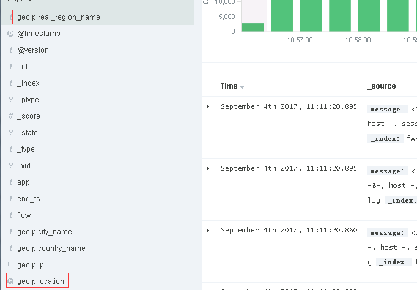
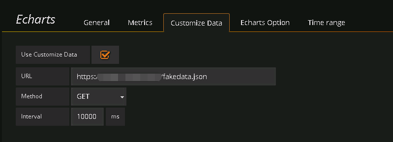
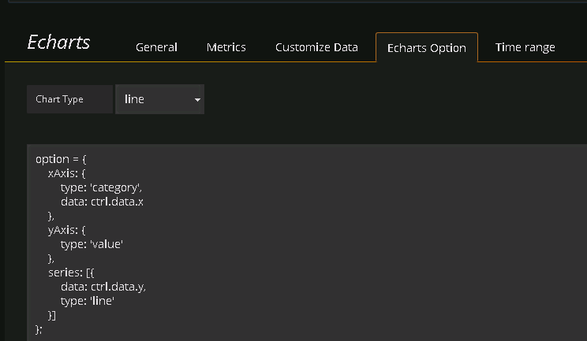
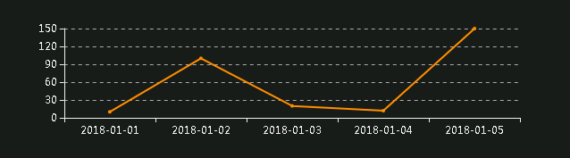

## Echarts Panel Plugin for Grafana

Grafana集成Echarts
Grafana v4.1.x 
Echarts v4.0.x

自定义数据源部分的代码出自这位大神 https://github.com/Billiballa/dxc-echarts-panel

## 中国地图
**ES数据源**


**Metrics**


**Echarts option**

```javascript
option = {
	title : {
	
	},
	tooltip : {
		trigger: 'item'
	},
	legend: {
		orient: 'vertical',
		left: 'left'
	},
	visualMap: {
		min: 0,
		max: 2000,         
		calculable: true,
		color: ['red','orange','yellow','lightgreen','green']
	},
	series : [
		{
			type: 'map',
			mapType: 'china',
			hoverable: true,
			roam:true,
			itemStyle:{
				normal:{label:{show:true}, areaColor: '#edf2f1'},
				emphasis:{label:{show:true}, areaColor: '#06060f'}
			},
			mapLocation: {
				y: "center",
				x: "center",
				height: "320"
			},
			label: {
				normal: {
					show: true
				},
				emphasis: {
					show: true
				}
			},
			data: ctrl.data
		}
	]
};
```
**效果图**


## 自定义数据源
**配置数据源**

示例中URL返回数据格式如下
```javascript
{"y": ["10", "100", "20", "12", "150"], "x": ["2018-01-01", "2018-01-02", "2018-01-03", "2018-01-04", "2018-01-05"]}
```

**配置Echarts**


**效果图**



## 插件安装
- 将本实例clone到你的plugins目录后重新启动grafana服务即可


## 插件开发
- git clone https://github.com/heruihong/grafana-echarts-panel
- npm install 
- grunt


## 附录
- [官方开发指南](http://docs.grafana.org/plugins/developing/development/)
- [官方示例插件](https://github.com/grafana/piechart-panel)